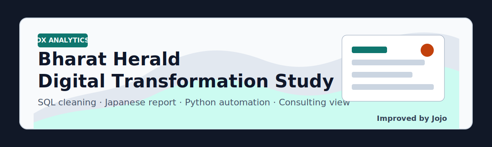

# Bharat Herald DX Analytics Improvement



This repository is an improved version of a pre-existing Codebasics RPC 17 digital transformation analytics project.  
The original English project files and datasets are preserved, while this version adds deeper SQL data cleaning, a Japanese business report, and a reproducible Python workflow.

## Why I Improved It

Traditional media companies often face the same problem: print revenue is weakening, but digital transformation cannot be decided only by enthusiasm.  
This project rebuilds the original analysis from a consulting perspective:

- Which cities should be prioritized for DX?
- Where is print circulation dropping fastest?
- Which advertising categories create revenue concentration risk?
- Does digital readiness actually convert into pilot engagement?
- How can SQL cleaning make the analysis more reliable?

## My Added Value

| Area | Improvement |
| --- | --- |
| SQL | Added deep cleaning logic with Japanese comments |
| Data quality | Standardized dates, currencies, city names, states, and category keys |
| KPIs | Added return rate, print efficiency, engagement rate, access cost, and DX priority score |
| Python | Built a zero-dependency report generator using SQLite + HTML + SVG |
| Report | Rebuilt the final analysis as a Japanese consulting-style HTML report |
| GitHub presentation | Added a clear project identity, attribution, and reproducible execution steps |

## Repository Structure

```text
.
├── Datasets/                         # Original source datasets
├── New Datasets/                     # Cleaned UTF-8 CSV files from the original project
├── improved_sql_jp/
│   └── 01_deep_data_cleaning.sql     # Japanese-commented SQL cleaning and analysis views
├── scripts/
│   ├── build_clean_db.py             # CSV -> SQLite -> cleaned tables/views
│   └── generate_japanese_report.py   # Cleaned DB -> Japanese HTML report
├── improved_outputs/
│   └── bharat_herald_dx_report_jp.html
├── old_sql_backup/                   # Original/previous SQL files kept for reference
├── primary_analysis_queries/         # Original primary query outputs
└── IMPROVEMENT_README_JP.md          # Japanese improvement notes
```

## How To Reproduce

Run from the project root:

```powershell
python scripts/build_clean_db.py
python scripts/generate_japanese_report.py
```

Generated outputs:

- `improved_outputs/bharat_herald_cleaned.sqlite`
- `improved_outputs/bharat_herald_dx_report_jp.html`

The SQLite file is intentionally ignored by git because it can be regenerated.

## Cleaning Logic

The improved SQL workflow creates normalized tables and views:

- `clean_dim_city`
- `clean_dim_ad_category`
- `clean_fact_print_sales`
- `clean_fact_ad_revenue`
- `clean_fact_city_readiness`
- `clean_fact_digital_pilot`
- `v_data_quality_summary`
- `v_print_monthly_momentum`
- `v_ad_category_concentration`
- `v_city_dx_priority`
- `v_executive_kpi`

Main cleaning points:

- Convert mixed quarter formats such as `2023-Q2`, `Q1-2019`, and `4th Qtr 2020`
- Convert mixed currencies into INR using fixed analysis rates
- Standardize city and state names
- Detect print logic inconsistencies
- Flag invalid revenue and readiness values
- Create consulting-oriented DX priority scoring

## Key Findings From The Improved Analysis

- 2024 net circulation: `29,597,065`
- 2024 average print efficiency: `94.53%`
- 2024 advertising revenue: `340,349,816 INR`
- Average 2024 DX readiness score: `68.34`
- Average pilot engagement rate: `54.58%`
- Highest DX priority city: `Kanpur`
- Largest monthly circulation drop: `Varanasi`, January 2021, `-59,807`

## Attribution

This project is based on an existing Codebasics RPC 17 digital transformation analytics project and dataset.  
The original project materials are kept in this repository for reference. My contribution is the improvement layer: SQL-based data cleaning, Japanese reporting, Python automation, and GitHub-ready documentation.

The original GitHub URL is add here:

```text
Original repository: <https://github.com/jogibunn/code_basics_rpc17.git>
```

## About Me

I am Jojo, a Kobe University Economics master's international student, empirical analysis, and IT consulting career preparation in Japan.

This project reflects the way I want to work as an IT/DX consultant:

- Start from messy data
- Make assumptions explicit
- Build a reproducible workflow
- Translate analysis into business decisions
- Communicate clearly in Japanese and English

## Tech Stack

- SQL / SQLite
- Python standard library
- HTML / CSS / SVG
- Business analytics
- Digital transformation strategy

